# 수정이력

2026-07-11 21:25

player가 프래그먼트 효과를 조작하지 못하는 오류를 수정하였습니다.

GM과 Player의 캐릭터 역할의 기본값을 룰북권장에 맞추어 교체하였습니다.

캐릭터 시트는 이제 채팅창과 마찬가지로 좌측에 내 캐릭터가 옵니다.


# Letter Duet 배포판

다운로드 페이지: https://github.com/april4ys/letter-duet-dist


Letter Duet은 드라코니언과 타키자토 후유가 개발해 초여명에서 한국어판으로 번역한 TRPG 룰인 언성듀엣과 관련하여 그 옵션룰인 레터세션(PBP, Play by Post형식)을 데스크톱 및 모바일 환경에서 편리하게 플레이하기 위해 ai를 활용하여 서서가 제작한 프로그램입니다.

(AI에 룰북 데이터를 직접 넣는 등의 학습 과정이 없었으며, 빠른 프로그램 작성을 위해서 AI를 사용했음을 알립니다.)

그중 이 페이지에서 배포하는 Letter Duet Dist(배포판)은 이러한 Letter Duet을 비개발자도 편리하게 이용할 수 있게끔 정적호스팅(예: Github Pages)과 Firebase Console만으로 실행할 수 있게 수정한 정적 배포판입니다.


## Firebase 준비

1. Firebase Console(https://console.firebase.google.com/)에 접속합니다.
2. 새 프로젝트를 만듭니다.

- 프로젝트 이름에는 문자, 숫자, 공백과 해당 문자(- ! ' ")만 포함하여 자유롭게 입력함(중요하지 않음)
- AI지원: 사용안함 해도 됨 / 애널리틱스: 사용안함 해도 됨 (둘다 별로 중요하지 않음)

3. 프로젝트에 웹 앱을 추가합니다(앱추가 > 웹).

- 앱 닉네임: 중요하지 않음 / Firebase 호스팅 설정: 설정안함
- 이후 나오는 소스코드의 아래 이미지와 같은 부분을 복사하여 메모해두세요(계정마다 다르므로 이미지의 내용을 그대로 입력하시면 안 됩니다).
  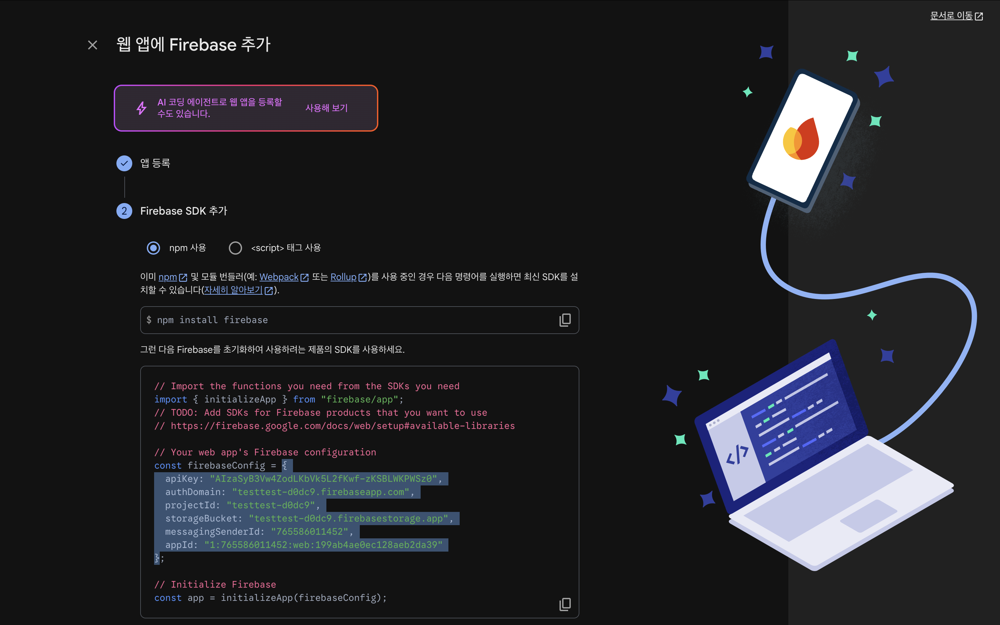
- 혹시 메모하는 걸 잊었거나 잃어버렸을 경우 다음과 같은 방법으로 다시 조회할 수 있습니다.
  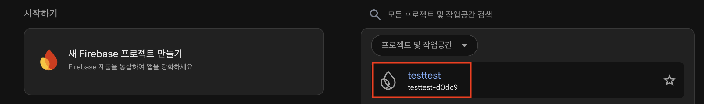
  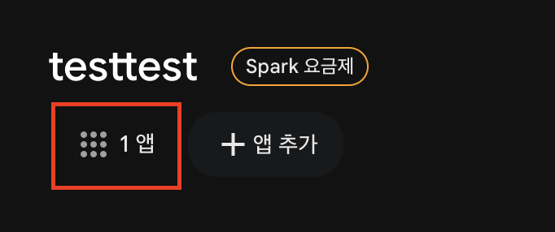
  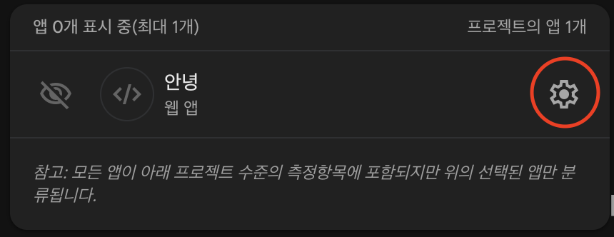

4. 좌측 프로젝트 메뉴 중 보안 > Authentication > 시작하기(혹은 로그인 방법 > 새 제공업체 추가)로 접속해 이메일/비밀번호 로그인을 활성화합니다.
   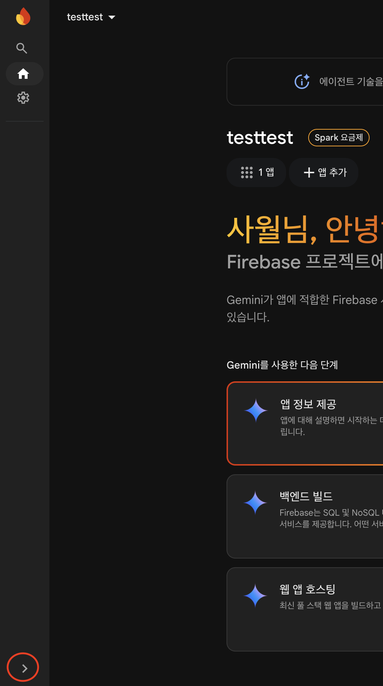
   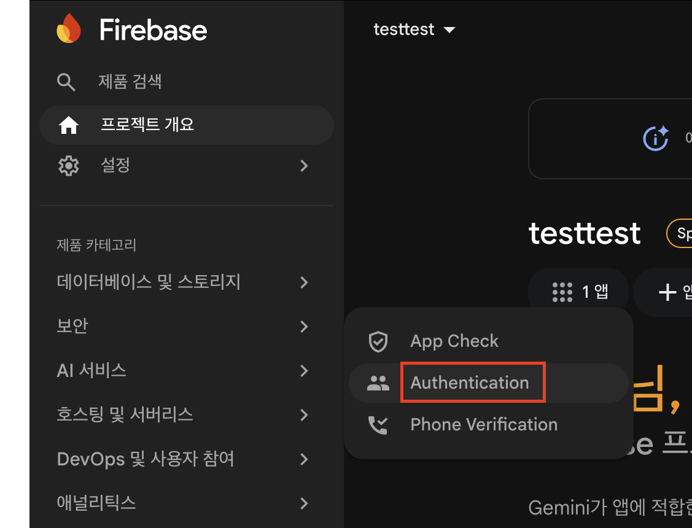
   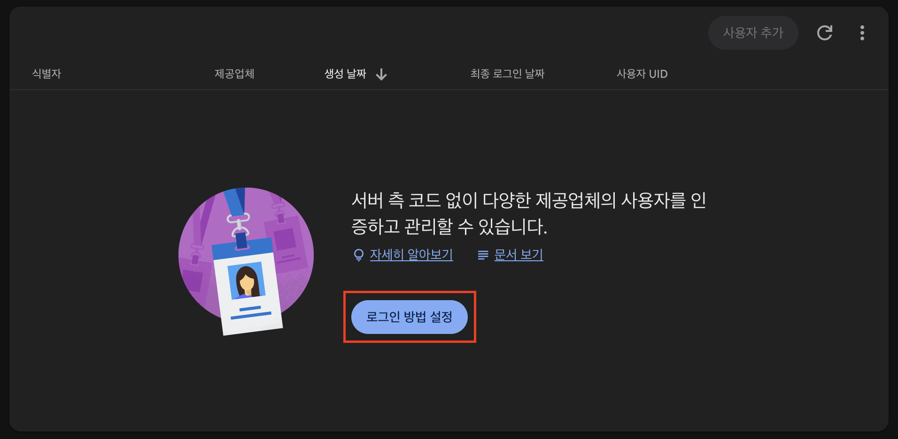
   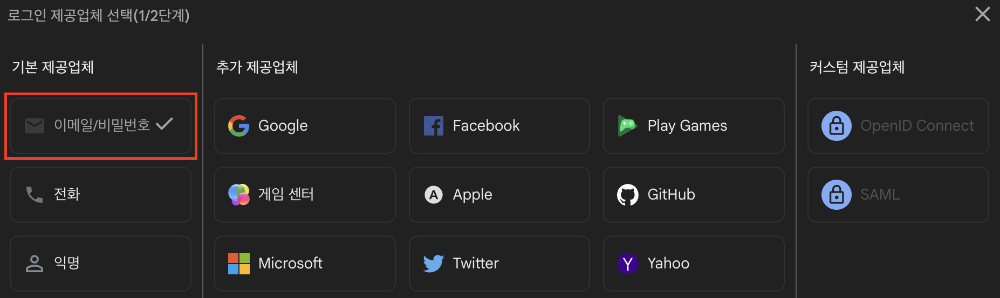
   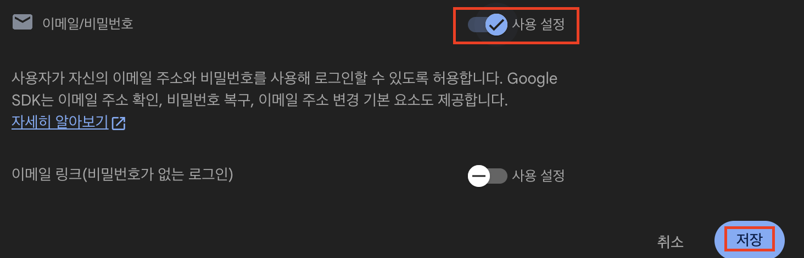
5. Authentication > 사용자 추가 > 나와 상대 플레이어의(반드시 두 개 까지만 입력해야 합니다) e-mail과 초기비밀번호를 세팅합니다.
   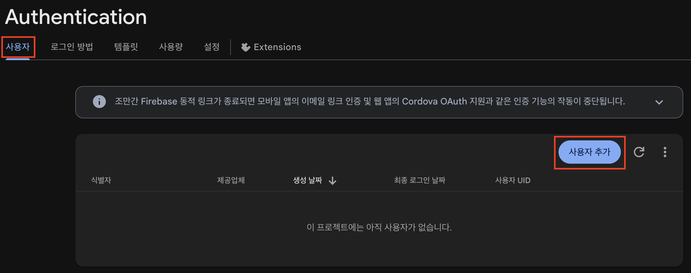

- 가상 e-mail로 사용해도 무방하나 실제 e-mail 사용시 앱내 이메일을 통한 비밀번호 찾기 기능 사용이 가능합니다.

6. 좌측 프로젝트 메뉴 중 데이터베이스 및 스토리지 > Firestore로 접속해 기본 데이터베이스를 생성합니다.
   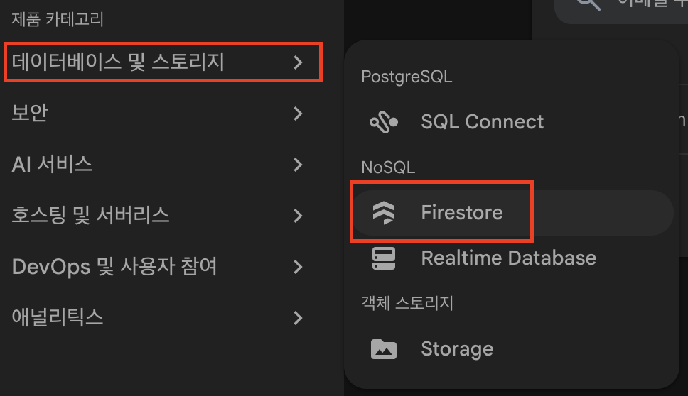
   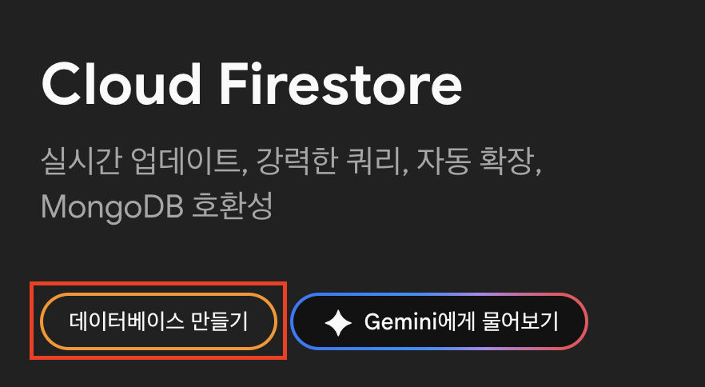

- 이 때 Standard 버전을 선택합니다(Enterprise의 경우 전문가/기업용이며 사용량 카운팅과 과금정책이 다릅니다).
- 위치는 asia-northeast3(Seoul)을 선택하시는 게 아마 이용중 속도가 가장 빠를 겁니다.
- 구성은 프로덕션 모드를 선택합니다.

7. Firestore의 Rules 화면에 `firestore.rules.txt`파일의 내용을 붙여넣고 게시합니다.

[firestore.rules.txt](https://github.com/april4ys/letter-duet-dist/blob/main/firestore.rules.txt)

   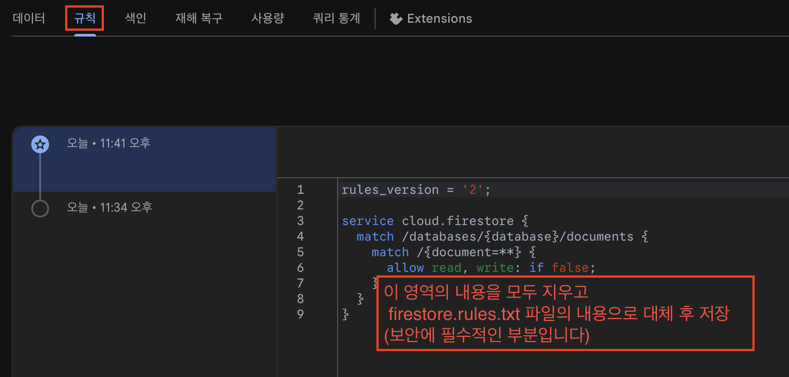

- 어플 사용 시 보안에 필수적인 부분입니다.

## Firebase 설정 입력

우선 letter-duet.zip 파일을 다운로드 받습니다.

[letter-duet.zip](https://github.com/april4ys/letter-duet-dist/blob/main/letter-duet.zip)

(view raw 클릭시 다운로드 됩니다)

다운로드 후 압축을 풀어 그 안의 파일 중 `firebase-config.json`을 텍스트 에디터(메모장 등)로 실행합니다.

그후 Firebase준비3에서 메모해둔 Firebase 웹 앱 설정값을 입력합니다.

이때, 아래 표기처럼 우측 값 뿐 아니라 좌측 변수명에도 쌍따옴표를 각각 붙여줘야 합니다(파이어베이스에서 복사한 값에서는 변수명에는 쌍따옴표가 빠져 있습니다).

```json
{
  "apiKey": "",
  "authDomain": "",
  "projectId": "",
  "storageBucket": "",
  "messagingSenderId": "",
  "appId": ""
}
```


## 정적 호스팅에 업로드

정적 호스팅에 수정된 firebase-config.json 파일을 포함한 lettter-duet.zip 내부 파일(압축이 풀어진)을 정적 호스팅에 업로드합니다.

예로, 저는 '나루' 정적호스팅을 사용하였습니다.


테스트 링크: [https://letter-duet.naru.pub/](https://letter-duet.naru.pub/)

Player1: aaaa@bb.com / 123456

Player2: cccc@dd.com / 123456

(비밀번호 수정 기능을 테스트판에서는 코드를 변경하여 의도적으로 막아두었습니다.)


## 주의사항

- 의도한 두 계정 외에는 Firebase Authentication 사용자를 추가하지 마세요. 이 프로그램은 firebase 연동 기준 두 명의 이용자만을 지원합니다.
- `firestore.rules`를 추가하기 전에는 서비스를 사용하지 마세요.
- 프로그램의 사용 및 수정 재배포 등은 CCL기준 저작자 표시, 비영리, 동일조건변경허락 조건으로 자유롭게 가능합니다. 단, 어떠한 경우에서도 언성듀엣과 그 한국어판 룰의 저작자인 드라코니언과 타키자토 후유, 초여명을 존중하는 방향 아래 사용해 주세요.
- Player에게도 삭제 권한이 부여되나, Room 및 Post(채팅으로 입력되는 모든 내용)의 삭제는 데이터베이스 내 완전한 삭제를 의미하지 않으며 해당 삭제한 내용을 데이터베이스를 뒤져 복구가 가능합니다. 이를 숙지한 상태로 이용을 권하며 이에 관해 데이터베이스의 권한이 없는 상대에게도 미리 주의를 주세요.
